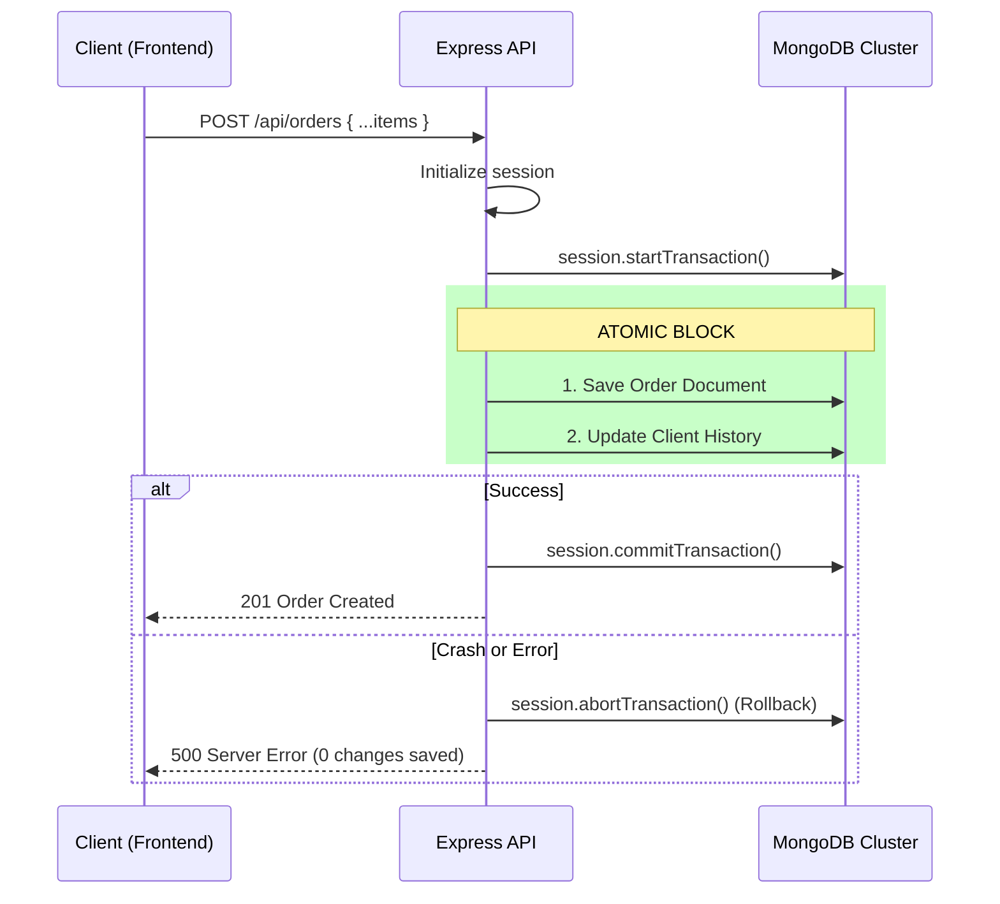
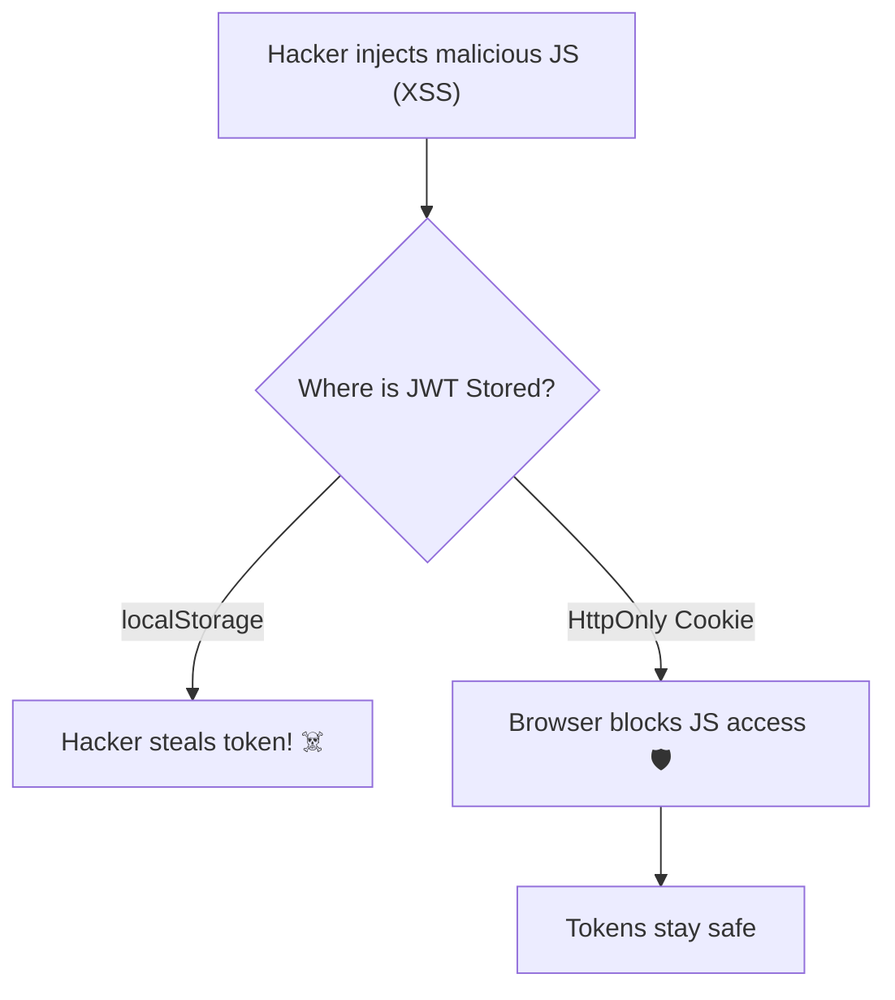
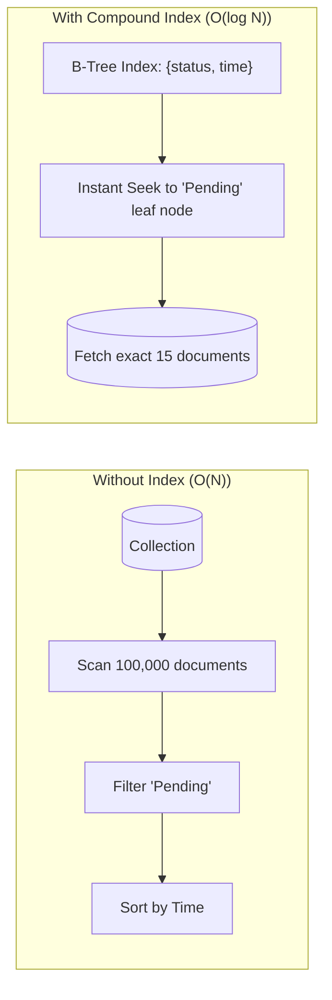
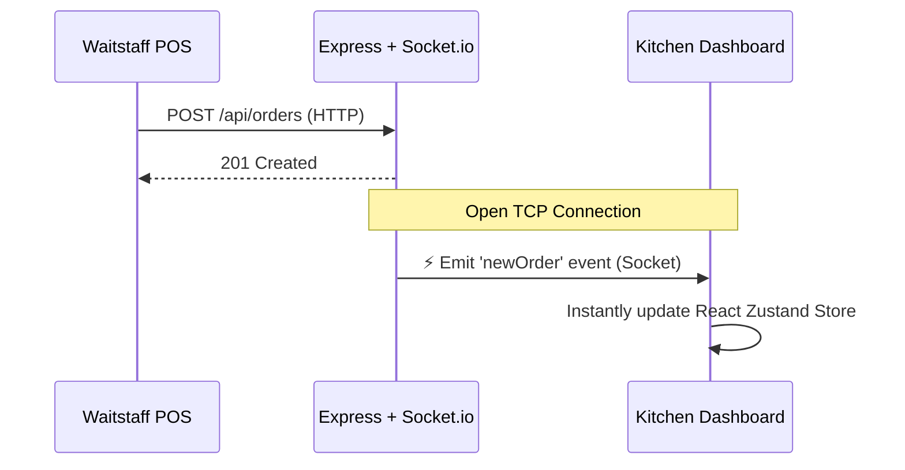
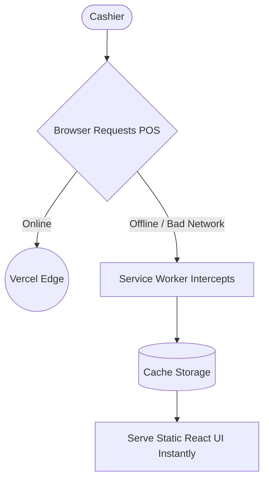

# Lead Engineer Interview Guide: Architecture Scaling 

This guide provides technical deep-dives into the architectural improvements implemented in our POS system. Use these diagrams and code snippets to visually construct your answers during interviews.

---

## 1. Database Atomicity (MongoDB Transactions)

**The Problem:** If a Node.js process crashes halfway through checking out an order, you might record the sale but fail to deduct the stock or update the customer's loyalty history. This leaves the database in a corrupted state.

**The Solution:** Implement a MongoDB Session Transaction. This guarantees ACID properties (Atomicity, Consistency, Isolation, Durability). 



**How to Explain It:**
> *"I identified a critical data integrity risk. If the server crashed after saving the order but before updating the client's history, the database would become out of sync. By wrapping the order creation flow in a MongoDB transaction, I ensured the operation is 'all-or-nothing'. If the client update fails, the order creation rolls back automatically, guaranteeing our financial data is always perfectly synchronized."*

**The Code:**
```javascript
// order.controller.js
const session = await mongoose.startSession();
session.startTransaction();

try {
    const order = await Order.create([{ /* ...order data */ }], { session });
    
    // Update client history
    await Client.findByIdAndUpdate(clientId, { $inc: { totalSpent: order[0].totalAmount } }, { session });
    
    await session.commitTransaction();
    res.status(201).json({ success: true, order });
} catch (error) {
    await session.abortTransaction();
    res.status(500).json({ error: "Transaction rolled back" });
} finally {
    session.endSession();
}
```

---

## 2. API Security (HttpOnly Cookies & Rate Limiting)

**The Problem:** Storing JWT auth tokens in `localStorage` makes them exposed to Cross-Site Scripting (XSS) attacks. Furthermore, our auth endpoints were vulnerable to automated brute-force password guessing.

**The Solution:** Shift tokens to `HttpOnly` Secure Cookies, and apply `express-rate-limit` middleware.



**How to Explain It:**
> *"Storing JWTs in local storage is a massive security vulnerability. I re-architected the auth flow to use HttpOnly and Secure cookies. This means the browser automatically handles the token, and malicious scripts cannot access it. Furthermore, I implemented API rate-limiting on our public routes to mitigate automated brute-force attacks and prevent resource exhaustion."*

**The Code (Backend):**
```javascript
// user.controller.js (Login)
const genrateToken = (userId, res) => {
    const token = jwt.sign({ userId }, process.env.JWT_SECRET, { expiresIn: "1d" });
    res.cookie("token", token, {
        httpOnly: true, // Invisible to JavaScript
        secure: process.env.NODE_ENV === "production", // HTTPS only
        sameSite: "strict", // Prevent CSRF
        maxAge: 86400000 
    });
};
```

---

## 3. Database Scalability (Compound Indexing)

**The Problem:** As the restaurant processes thousands of orders, querying for "Recent Pending Orders" forces MongoDB to scan every single document (a `COLLSCAN`). This is `O(N)` complexity and scales poorly.

**The Solution:** Introduce a Compound B-Tree Index on the `Order` collection for the fields queried together.



**How to Explain It:**
> *"The most frequent read operation is fetching recent, pending orders for the kitchen. As the collection scales, a full collection scan would cripple database latency. By applying a compound B-Tree index specifically on 'status' and 'createdAt', I reduced the time complexity of that query from O(N) to O(log N). The database now reads only the exact documents it needs, ensuring sub-millisecond query times even at vast scale."*

**The Code:**
```javascript
// order.model.js
const orderSchema = new mongoose.Schema({
    status: { type: String, enum: ["Pending", "Preparing", "Ready"] },
    // ...other fields
}, { timestamps: true });

// Compound index for optimizing kitchen dashboard queries
orderSchema.index({ status: 1, createdAt: -1 });

const Order = mongoose.model("Order", orderSchema);
```

---

## 4. Real-Time Architecture (WebSockets)

**The Problem:** The waitstaff and kitchen needed to see order updates immediately. Traditional REST APIs forced the frontend to "poll" (ping the server every 5 seconds), causing massive server overhead in Node.js.

**The Solution:** Replaced HTTP Polling with an Event-Driven architecture using `Socket.io`.



**How to Explain It:**
> *"In a high-intensity kitchen, a 5-second polling delay in order transmission is unacceptable, but 1-second polling would overload our Node event loop. I shifted us to an event-driven architecture using WebSockets. Now, the Express backend explicitly pushes `newOrder` events natively through open TCP connections. It reduced our server load by eliminating thousands of empty HTTP requests and gave the client true zero-latency updates."*

**The Code:**
```javascript
// Frontend: store/useOrderStore.js
setupSocketListeners: () => {
    const socket = getSocket();
    if (!socket) return;
    
    socket.on("newOrder", (newOrder) => {
        set((state) => ({ recentOrders: [newOrder, ...state.recentOrders] }));
    });
}
```

---

## 5. Frontend Fault Tolerance (Progressive Web App)

**The Problem:** POS systems are mission-critical. If the restaurant's local Internet drops, the React app hosted on Vercel becomes unreachable, bringing operations to a halt.

**The Solution:** Configured a Progressive Web App (PWA) using `vite-plugin-pwa` with Service Workers to cache the "App Shell" locally.



**How to Explain It:**
> *"By configuring a Progressive Web App (PWA) Service Worker, we aggressively cache the application shell locally on the cashier's tablet. If the restaurant loses internet connectivity, the POS doesn't crash to a 'No Internet' dinosaur page; the UI remains fully functional from the local cache."*
