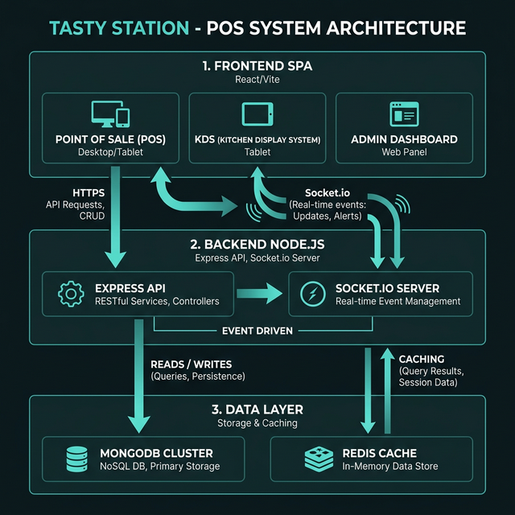

# Tasty Station - Enterprise Restaurant POS System 🍽️

**Tasty Station** is a high-performance, enterprise-grade Point of Sale (POS) application designed for modern restaurants. It streamlines operations from order taking to kitchen management, inventory tracking, and financial reporting. Built on the **MERN Stack** and optimized for scale with **WebSockets**, **Progressive Web App (PWA)** resilience, and **MongoDB Transactions**, it ensures lightning-fast performance even under heavy lunch-rush loads.

 <!-- Update with actual screenshot later -->

---

## 🚀 Live Demo

**Application URL:** [https://tastystation.vercel.app](https://tastystation.vercel.app)

### 🔑 Login Credentials

Explore the system using the following Admin credentials:
- **Email:** `admin@me.com`
- **Password:** `12345678`

*(Cashier and Kitchen roles can be created via the Admin panel)*

---

## 🗺️ System Architecture

Tasty Station employs a decoupled architecture separating the UI layer from the API layer, communicating over secure REST protocols and real-time TCP sockets.



---

## ✨ Enterprise Features By Layer

To dive deep into the technical engineering of each layer, read the dedicated sub-docs:
*   📜 [**Frontend Technical Documentation (`frontend/README.md`)**](./frontend/README.md)
*   📜 [**Backend Technical Documentation (`backend/readme.md`)**](./backend/readme.md)

### 1. 🛡️ Backend Data Integrity & Security
*   **Atomicity:** Order creation is wrapped in **MongoDB Transactions** to ensure multi-step financial logic rolls back atomically if a server crashes mid-flight.
*   **Stateless Auth:** JSON Web Tokens (JWT) are securely handled via **HttpOnly cookies**, rendering the application immune to Cross-Site Scripting (XSS) attacks.
*   **Rate Limiting:** Public endpoints are protected by `express-rate-limit` to block automated brute-force attempts.
*   **Query Performance:** Complex dashboard reads are accelerated via custom **Compound B-Tree Indices**.

### 2. ⚡ Frontend Fault Tolerance & UX
*   **Offline Support (PWA):** Cashier tablets aggressive cache the "App Shell" using Service Workers. If the restaurant loses internet, the POS remains fully navigable from local cache.
*   **Code-Splitting:** Time-To-Interactive is minimized by lazy-loading the massive administrative charts using `React.lazy` and `Suspense`, shipping only the bare-minimum JS required to boot the checkout terminal.
*   **Keyboard Accessibility:** Global keyboard shortcuts (e.g., `Enter` to checkout) expedite the workflow for high-volume cashiers.
*   **Stable Rendering:** Heavy UI lists scale seamlessly via `React.memo` preventing unnecessary Virtual DOM re-renders.

### 3. 📡 Real-Time Kitchen Sync
*   Traditional HTTP polling is replaced with an event-driven architecture using **WebSockets**. The Express backend natively pushes `newOrder` events via TCP to the Zustand global state—eliminating manual refreshes and server overhead.

---

## ⚙️ How It Works (Order Workflow)

1.  **Authentication:** Users log in securely. The server issues an HTTP-Only cookie containing the JWT.
2.  **Role Verification:** Every API request passes through a middleware that verifies the user's role (Admin vs Cashier vs Kitchen).
3.  **Data Retrieval (Optimized):**
    *   **Step A:** The server checks **Redis Cache** (Speed: ~10ms).
    *   **Step B:** If not in cache, the server queries MongoDB, applies the results, and writes back to Redis for future requests.
4.  **Real-Time Push:** Once a cashier submits an order, it is saved atomically in MongoDB, and the Express Socket.io server broadcasts the ticket to the Kitchen UI.

---

## 🛠️ Setup & Installation

To run this project locally:

1.  **Clone the repository:**
    ```bash
    git clone https://github.com/hey-Zayn/POS.git
    cd POS
    ```

2.  **Backend Setup:**
    ```bash
    cd backend
    npm install
    # Create .env file with MONGO_URI, REDIS_URL, JWT_SECRET, CLOUDINARY credentials
    npm run dev
    ```

3.  **Frontend Setup:**
    ```bash
    cd frontend
    npm install
    # Create .env with VITE_API_BASE_URL
    npm run dev
    ```

4.  **Access App:**
   Open `http://localhost:5173` in your browser.
