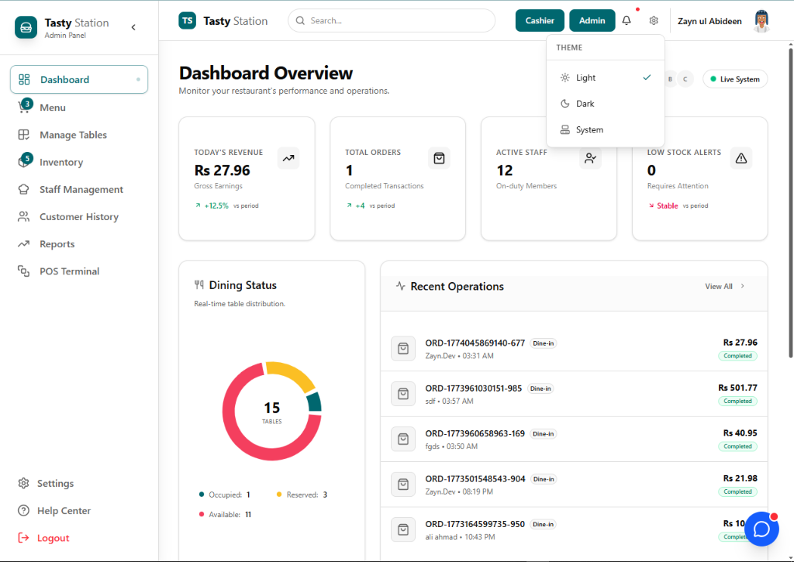
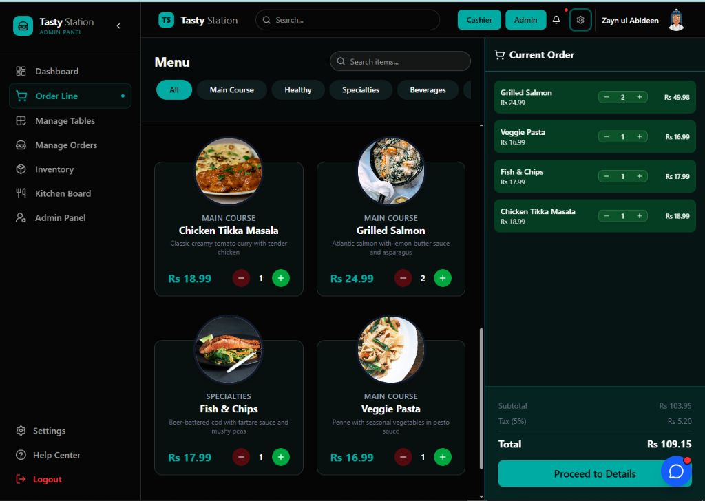
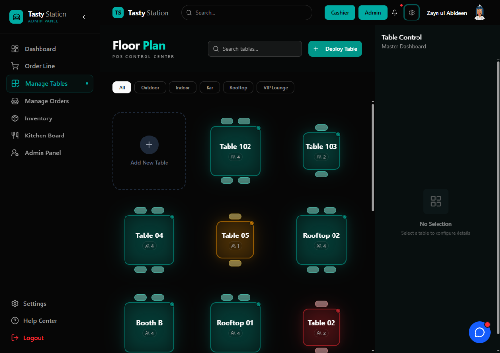
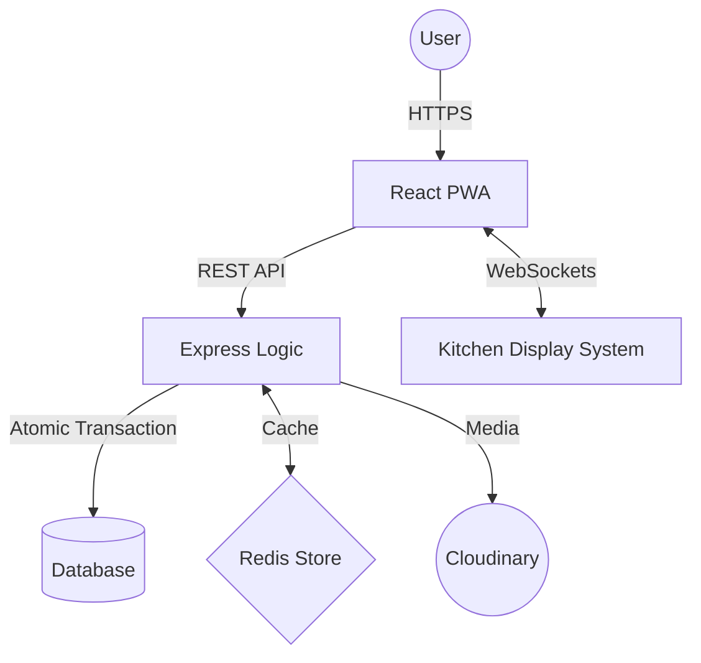

# Tasty Station - Enterprise Restaurant POS System 🍽️

[](https://vitejs.dev/)
[](https://reactjs.org/)
[](https://nodejs.org/)
[](https://expressjs.com/)
[](https://socket.io/)
[](https://redis.io/)
[](https://www.mongodb.com/)
[](https://vitest.dev/)
[](https://opensource.org/licenses/MIT)

**Tasty Station** is a high-performance, enterprise-grade Point of Sale (POS) and Kitchen Display System (KDS) designed for modern high-volume restaurants. Built for speed, resiliency, and accuracy, it leverages the MERN stack with advanced engineering patterns to handle the "Lunch Rush" without breaking a sweat.

[**Explore the Demo**](https://tastystation.vercel.app) • [**Technical Docs**](./docs) • [**Report Bug**](#)

---

## 🖼️ Preview



> _Premium SaaS Aesthetic with Dark Mode support and Real-time syncing._

---

## ⚡ Core Engineering Pillars

### 1. 🛡️ Data Integrity & Atomic Financials

- **MongoDB Transactions:** Every order involves multi-document writes (Orders, Client Stats, Inventory Deduplication). We use **ACID Transactions** to ensure that either all updates succeed or none do—preventing financial drift.
- **Redis Caching Layer:** Dashboard analytics and frequent menu reads are served via **Redis** memory stores, dropping retrieval times from `~150ms` (DB) to `<12ms`.
- **Stateless Security:** Authentication is handled via **HttpOnly JWT Cookies**, providing a robust defense against XSS and CSRF.

### 2. 📡 Real-Time Kitchen Display System (KDS)

- **Socket.io Integration:** Orders are not polled via HTTP. They are pushed instantly to kitchen monitors via event-driven WebSockets.
- **Station Synchronization:** When a chef marks an order as "Ready," the Cashier UI reflects the status change in milliseconds without a page refresh.

### 3. 📱 Progressive Web App (PWA) Capability

- **Offline Resilience:** Designed to handle "Internet Drops." Critical app shells are cached via Service Workers, ensuring the POS remains navigable and operational on local hardware even during downtime.

### 4. 🧪 Robust Testing & Code Quality

- **Unit & Integration:** Powered by **Vitest** and **React Testing Library**.
- **API Validation:** Synthetic endpoint testing via **Supertest** with an isolated `mongodb-memory-server` fixture for 100% data safety.
- **Strict Standards:** Enforced with **ESLint** (Flat Config) ensuring clean, predictable, and error-free code across the stack.

---

## 👤 Persona-Based Experience

### 👑 Admin Portal
- **Advanced Analytics:** Visualize sales trends, peak hours, and server performance.
- **Menu Management:** Dynamic category creation, cloudinary-integrated image uploads, and inventory tracking.
- **User RBAC:** Manage permissions for Cashiers, Waiters, and Kitchen staff.

### 📟 Cashier Terminal
- **Rapid Checkout:** Optimized for touch-screens and keyboard shortcuts.
- **Table Management:** Real-time visibility of table occupancy and order status.
- **Client Profiles:** Quick access to regular customers and loyalty stats.

### 👨‍🍳 Kitchen Display (KDS)
- **Live Ticket Feed:** Orders appear instantly with preparation time trackers.
- **Status Toggles:** One-click updates for "Preparing," "Ready," and "Delivered."

---

## 🎨 Visual Experience

### Modern Menu Interface (Light & Dark Mode)
| Light Mode | Dark Mode |
| :--- | :--- |
|  |  |

### 🗺️ Dynamic Floor Plan & Table Management
Tailor your restaurant layout in real-time. Occupancy tracking and seat management at a glance.

| Light Mode | Dark Mode |
| :--- | :--- |
|  |  |

---

## 📂 Project Topography

```text
POS/
├── backend/                # Express API & Business Logic
│   ├── config/             # Database & Cloudinary configs
│   ├── controllers/        # Request handlers
│   ├── models/             # Mongoose Schemas (ACID enabled)
│   ├── routers/            # API Endpoints
│   └── __tests__/          # Vitest & Supertest suite
├── frontend/               # Vite + React Client
│   ├── src/
│   │   ├── components/     # Atomic UI components
│   │   ├── pages/          # View-layer logic
│   │   ├── store/          # Zustand state management
│   │   └── axios/          # Configured Interceptors
├── docs/                   # Engineering diagrams & reports
└── readme.md               # You are here
```

---

## 🛠️ Tech Stack

| Layer              | Technologies                                                    |
| :----------------- | :-------------------------------------------------------------- |
| **Frontend**       | React 19, Vite, Zustand, Framer Motion, Tailwind CSS, Shadcn UI |
| **Backend**        | Node.js, Express, MongoDB, Socket.io, Redis                     |
| **DevOps/Testing** | Vitest, Supertest, ESLint, Vercel                               |
| **Cloud**          | Cloudinary (Image Management)                                   |

---

## 🗺️ System Architecture

<br/>


<br/>

<details>
<summary>📐 View technical Mermaid flowchart</summary>


</details>

<br/>

---

## 🚀 Roadmap

- [ ] **AI Inventory Forecasting**: Predicting stock depletion using Gemini AI.
- [ ] **Multi-Outlet Sync**: Centralized dashboard for restaurant chains.
- [ ] **QR Code Ordering**: Customer-facing self-service interface.
- [ ] **Mobile App (React Native)**: Native POS for handheld device speed.

---

## ⚙️ Quick Start

### 1. Initial Setup

```bash
git clone https://github.com/hey-Zayn/POS.git
cd POS
```

### 2. Environment Configuration

Create a `.env` in both `/backend` and `/frontend` using the provided keys in the technical documentation.

### 3. Launch Development Environments

```bash
# Terminal 1: Backend
cd backend && npm install && npm run dev

# Terminal 2: Frontend
cd frontend && npm install && npm run dev
```

---

## 🤝 Contributing

Contributions are what make the open source community such an amazing place to learn, inspire, and create. Any contributions you make are **greatly appreciated**.

1. Fork the Project
2. Create your Feature Branch (`git checkout -b feature/AmazingFeature`)
3. Commit your Changes (`git commit -m 'Add some AmazingFeature'`)
4. Push to the Branch (`git push origin feature/AmazingFeature`)
5. Open a Pull Request

---

## 📄 License

Distributed under the MIT License. See `LICENSE` for more information.

## ✉️ Contact

Zayn - [GitHub](https://github.com/hey-Zayn)

**If you found this project helpful, please give it a ⭐ to show your support!**

---

### 🏷️ Keywords
Restaurant POS, MERN Stack, Kitchen Display System, Real-time WebSockets, MongoDB Transactions, React PWA, Node.js API, Inventory Management.
